# CentOS7 APM 설치
 

※ 환경 구성 내역 
|          | Apache   |    PHP   |   Mysql  |   apr    | apr-util |   pcre   |  openssl |  cmake   |
| :------: | :------: | :------: | :------: | :------: | :------: | :------: | :------: | :------: |
| Version  |  2.4.54  |  5.3.13  |  5.6.30  |  1.5.2   |  1.5.4   |   8.37   |  1.1.1q  |   3.5.2  |
 

### 1.  Apache 
   - 설치 경로
    # wget https://mirror.kakao.com/apache/httpd/httpd-2.4.54.tar.gz
 

### 2.  Mysql 
   - 설치 경로 
    # wget http://dev.mysql.com/get/Downloads/MySQL-5.6/mysql-5.6.30.tar.gz
 

### 3. php 
   - 설치 경로
    # wget http://kr1.php.net/get/php-5.6.25.tar.gz/from/this/mirror 
 

### 4. apr 
   - 설치 경로 
    # wget https://archive.apache.org/dist/apr/apr-1.5.2.tar.gz 
 

### 5. apr-util
   - 설치 경로
    # wget https://archive.apache.org/dist/apr/apr-util-1.5.4.tar.gz 
 

### 6. pcre
   - 설치 경로 
    # wget https://ftp.cs.stanford.edu/pub/exim/pcre-8.40.tar.gz 
 

### 7. openssl
   - 설치 경로
    # wget https://www.openssl.org/source/old/1.1.1/openssl-1.1.1q.tar.gz
 

### 8.cmake
   - 설치경로
    # wget https://cmake.org/files/v3.5/cmake-3.5.2.tar.gz
 

---
 

## [Apache Source 설치]
 
1. 기존에 설치된 Apache 웹서버 제거  
 
# yum remove -y httpd httpd-* 

  
2. 빌드 환경 설정

 
# yum install -y make gcc g++ gcc-c++ autoconf automake libtool pkgconfig findutils oepnssl openssl-devel openldap-devel pcre-devel libxml2-devel lua-devel curl curl-devel libcurl-devel flex 

 
3. 관련 모듈 다운로드 및 설치 (필수 설치X)

 

① apr 다운로드

cd /usr/local/src

wget https://archive.apache.org/dist/apr/apr-1.5.2.tar.gz 

tar xvfz apr-1.5.2.tar.gz

cd apr-1.5.2

./configure --prefix=/usr/local/apr

make

make install

 

② apr-util 다운로드

cd /usr/local/src

wget https://archive.apache.org/dist/apr/apr-util-1.5.4.tar.gz 

tar xvzf apr-util-1.5.4.tar.gz

cd apr-util-1.5.4

./configure --with-apr=/usr/local/apr/

make

make install

 

③ pcre 다운로드

cd /usr/local/src

wget http://downloads.sourceforge.net/project/pcre/pcre/8.37/pcre-8.37.tar.gz

tar xvzf pcre-8.37.tar.gz

cd pcre-8.37

./configure --prefix=/usr/local/pcre

make

make install

 
4. Apache 웹서버 다운로드 및 설치

 
cd /usr/local/src

wget https://mirror.kakao.com/apache/httpd/httpd-2.4.54.tar.gz

ar xvfz httpd-2.4.23.tar.gz

mv apr-1.5.2 httpd-2.4.23/srclib/apr

mv apr-util-1.5.4 httpd-2.4.23/srclib/apr-util

cd httpd-2.4.23

./configure --enable-module=so --enable-mods-shared=most --enable-maintainer-mode --enable-deflate --enable-headers --enable-rewrite --enable-ssl --enable-proxy --enable-proxy-http --enable-proxy-ajp --enable-proxy-balance --with-pcre=/usr/local/pcre --prefix=/usr/local/apache

make

make install
 

 
5. Apahce 웹서버 서비스 등록 및 실행

 
(1) httpd 서비스 파일 만들기

cp /usr/local/apache/bin/apachectl /etc/init.d/httpd

vi /etc/init.d/httpd
 

vi에디터로 httpd 파일이 열리면 아래 #으로 처리된 내용을 그대로 추가하고 저장한다.
 
#!/bin/sh
#### # chkconfig: 2345 90 90
#### # description: init file for Apache server daemon
#### # processname: /usr/local/apache/bin/apachectl
#### # config: /usr/local/apache/conf/httpd.conf
#### # pidfile: /usr/local/apache/logs/httpd.pid
 

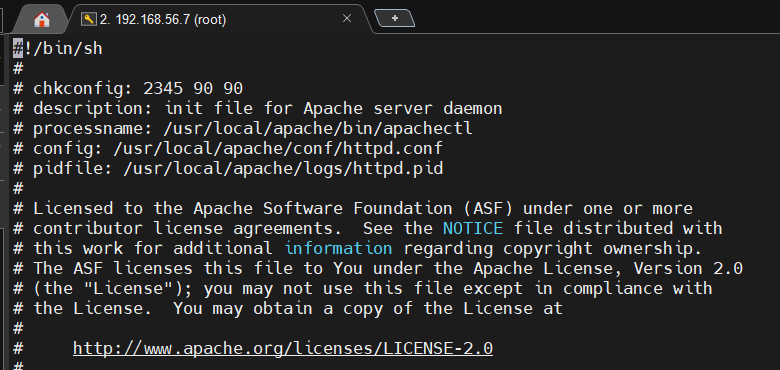

 

 

(2) httpd.conf 파일 수정

vi /usr/local/apache/conf/httpd.conf

vi에디터로 httpd.conf 파일이 열리면 ServerName 부분을 찾아 주석을 제거하고 사용할 서버명을 입력한다. (여기서는 localhost로 한다)

ServerName localhost
 

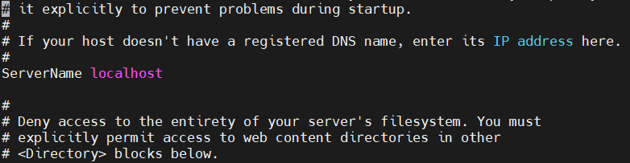
 

그리고 아래로 내려가 내용을 주석처리하고 저장한다. 
 
#LoadModule unique_id_module modules/mod_unique_id.so

 

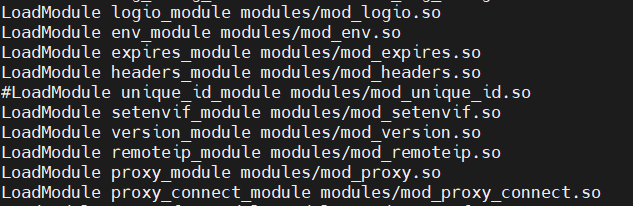
 

(3) httpd 서비스 시작

service httpd start

-> 별다른 오류가 없다면 정상 실행 된거다. 

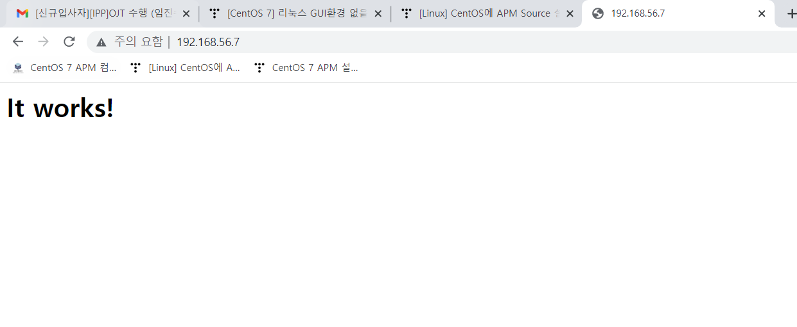

 

------

 

## [MySQL Source 설치]
 
1. 기존에 설치된 MySQL과 cmake 삭제

 

yum remove -y mysql* cmake

 
2. 빌드 환경 설정

yum install -y zlib zlib-devel cpp perl bison freetype freetype-devel freetype-utils ncurses-devel libtermcap-devel bzip2-devel

 
3. cmake 다운로드 및 설치

 
MySQL 5.5부터는 ./configure가 아닌 cmake를 통해 컴파일을 진행해야 한다.

 

cd /usr/local/src

wget https://cmake.org/files/v3.5/cmake-3.5.2.tar.gz

tar xvfz cmake-3.5.2.tar.gz

cd cmake-3.5.2

./bootstrap

make && make install

 
4. MySQL 그룹 및 계정 만들기

groupadd mysql

useradd -g mysql mysql

 
5. MySQL 다운로드

cd /usr/local/src

wget http://dev.mysql.com/get/Downloads/MySQL-5.6/mysql-5.6.30.tar.gz

tar xvfz mysql-5.6.30.tar.gz

cd mysql-5.6.30

 
6. MySQL cmake 컴파일

/usr/local/bin/cmake \
-DCMAKE_INSTALL_PREFIX=/usr/local/mysql \
-DDEFAULT_CHARSET=utf8 \
-DDEFAULT_COLLATION=utf8_general_ci \
-DWITH_EXTRA_CHARSETS=all \
-DENABLED_LOCAL_INFILE=1 \
-DMYSQL_DATADIR=/usr/local/mysql/data \
-DMYSQL_USER=mysql \
-DWITH_INNOBASE_STORAGE_ENGINE=1 \
-DWITH_ARCHIVE_STORAGE_ENGINE=1 \
-DWITH_BLACKHOLE_STORAGE_ENGINE=1 \
-DWITH_PERFSCHEMA_STORAGE_ENGINE=1 \
-DMYSQL_UNIX_ADDR=/usr/local/mysql/mysql.sock \
-DMYSQL_TCP_PORT=3306

make

make install

 
7. mysql그룹/계정 권한주기

chown -R mysql:mysql /usr/local/mysql --> chown -R (계정명):(그룹명) /usr/local/mysql

chown -R mysql:mysql /usr/local/mysql/data

 
8. DB 생성

cd /usr/local/mysql

./scripts/mysql_install_db --user=mysql --datadir=/usr/local/mysql/data

 
9. MySQL 설정파일 및 데몬 복사 / base, datadir지정

cp support-files/my-default.cnf /etc/my.cnf

#(메모리 용량에 따라 my- 뒤에 이름이 다를 수 있음)

#(이미 존재하는 파일이라면 덮어씌우면 됨)

cp support-files/mysql.server /etc/init.d/mysqld

chmod 755 /etc/init.d/mysqld

vi /etc/init.d/mysqld 

 
#입력 후 아래 내용 추가

#basedir=/usr/local/mysql

#datadir=/usr/local/mysql/data
 

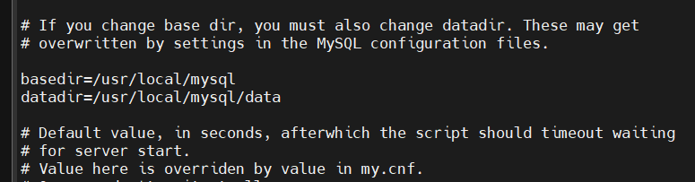

 
10. 환경변수 등록 및 MySQL 데몬 실행

cd ~

vi .bash_profile

#PATH부분에 아래 내용을 추가한다

PATH=$PATH:$HOME/bin:/usr/local/mysql/bin
 

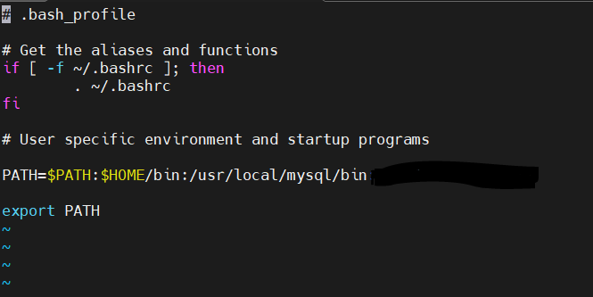

 

source .bash_profile

service mysqld start 
--> service mysqld start로 msyql의 데몬을 실행하면 mysql만 입력해도 root계정을 통해 mysql에 접근이 가능하다.

 

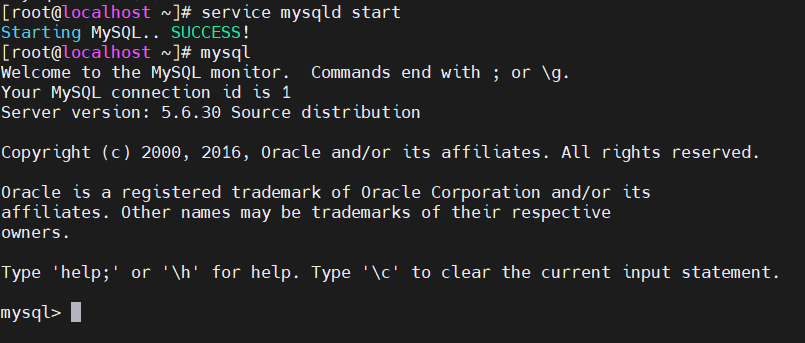

 

---
 

## [php source 설치]
 
1. 빌드 환경 설정

yum install -y libjpeg libjpeg-devel libjpeg-turbo-devel gd gd-devel gdbm-devel php-mbstring libexif-devel libmcrypt libmcrypt-devel libvpx libvpx-devel libXpm libXpm-devel icu libicu libicu-devel t1lib t1lib-devel gmp-devel mhash* gettext gettext-devel libtidy libtidy-devel libxslt libxslt-devel libedit-devel libc-client libc-client-devel pam-devel readline-devel libpng libpng-devel krb5-devel db4-devel expat*

 
2. PHP 다운로드 및 컴파일

cd /usr/local/src

wget http://kr1.php.net/get/php-5.6.25.tar.gz/from/this/mirror

tar xvfz mirror

cd php-5.6.25

./configure --prefix=/usr/local/php \
--with-apxs2=/usr/local/apache/bin/apxs \
--with-config-file-path=/usr/local/apache/conf \
--with-mysql=/usr/local/mysql \
--with-mysql-sock=/usr/local/mysql \
--with-mysqli=/usr/local/mysql/bin/mysql_config \
--with-pdo-mysql=/usr/local/mysql \
--with-regex=php \

make

make install

 
3. PHP 환경설정

cp php.ini-production /etc/httpd/php.ini

vi /etc/httpd/php.ini
 

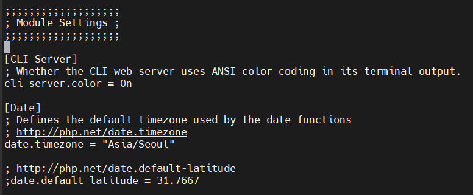
 
4. Apache 환경설정

vi /usr/local/apache/conf/httpd.conf

-->  httpd.conf 내에서 PHP모듈(노란색)이 정상적으로 추가되어있는지 확인 (자동으로 연동되어 등록됨)
 

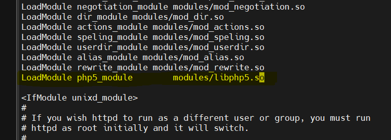
 

IfModule dir_module을 찾아 아래 내용 추가

DirectoryIndex index.html index.htm index.php index.cgi
 

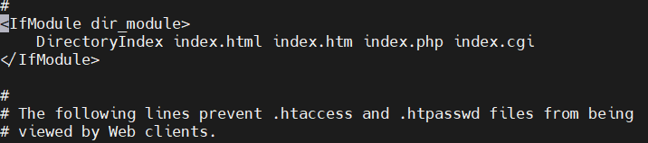
 

IfModule mime_module 을 찾아 아래 내용 추가

AddType application/x-compress . z

AddType application/x-gzip . gz . tgz

AddType application/x-httpd-php .php .php3 .php4 .php5 .phtml .html .htm .inc

AddType application/x-httpd-source .phps
 

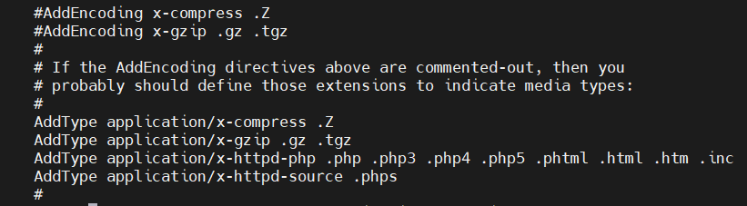
 

#httpd.conf 저장한 뒤

/etc/init.d/httpd restart

 
5. 환경변수 등록

 

cd ~

vi .bash_profile

#PATH부분에 아래 내용을 추가한다

PATH=$PATH:$HOME/bin:/usr/local/mysql/bin:/usr/local/php/bin
 

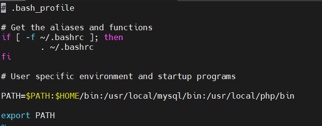
 

#.bash_profile 저장한 뒤

source .bash_profile

 
6. 연동 확인

vi /usr/local/apache/htdocs/phpinfo.php

-> 연두색 부분 추가
 

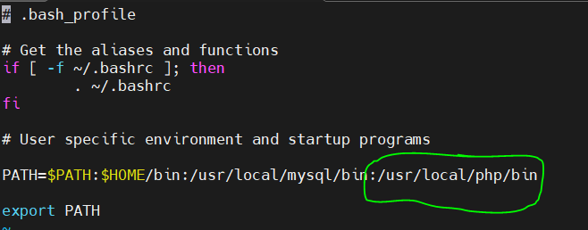
 

:wq 입력하여 저장 후 나가기

 
결과물 : 

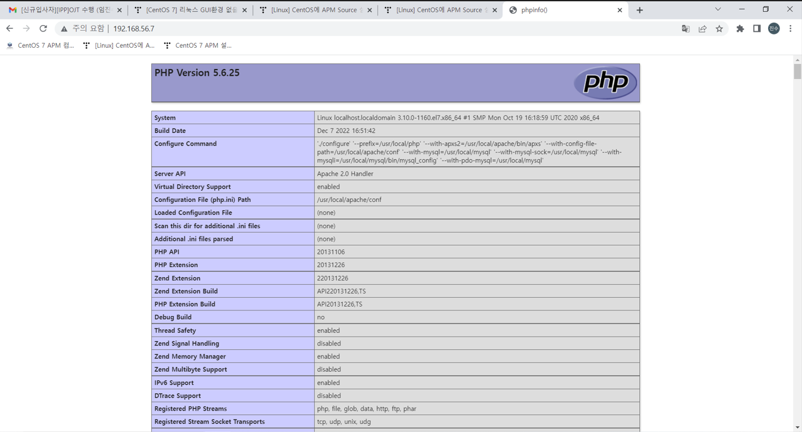
 

이렇게 APM 설치를 마무리했다.

---
 
- 출처

    https://jguru-study.tistory.com/29

    https://jguru-study.tistory.com/30

    https://jguru-study.tistory.com/31

